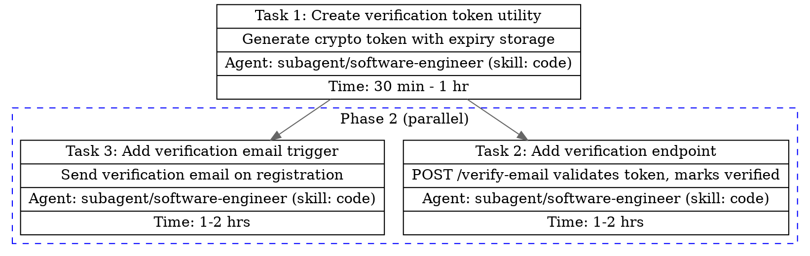

## Workflow

1. **Receive** goal + context from the caller
2. **Derive feature name** — transform the goal into kebab-case (e.g., "Add user authentication" → `add-user-auth`). Strip filler words (the, a, an, for, to). Keep it under 5 words.
3. **Read for context** — scan relevant files to understand the codebase: entry points, existing patterns, test conventions, project language(s)
4. **Decompose** the goal into atomic tasks — each completable in < 8 hours. If a task exceeds 8 hours, break it further.
5. **Map dependencies** — for each task, ask: "What MUST be done before this?" Only mark true blockers.
6. **Group into phases** — topological sort on dependencies, then group independent tasks at the same level into parallel phases
7. **Assign agent + skill** — use the assignment table below
8. **Add evaluator gates** — Between phases, insert evaluation checkpoints. Each gate should:
   - Reference the sprint contract exit criteria from the PRD
   - Define how to verify completion (test commands, manual checks)
   - Specify what happens on failure (route critique back to generator)
9. **Write per-task files** first: `__docs/task/<feature>__task-<NNN>.md`
10. **Write main file**: `__docs/task/<feature>__main.md` with summary table, DOT digraph, risks
11. **Return** structured output to caller

## Decomposition Procedure

This is the core of the skill — how to break a goal into the right tasks.

### Step A: Identify boundaries

Ask these questions about the goal:

- What new files need to be created?
- What existing files need to change?
- What tests need to be written or updated?
- What documentation needs updating?
- Are there infrastructure/config changes?

Each answer cluster is a candidate task.

### Step B: Apply the atomicity test

For each candidate task, check:

- **Single responsibility** — does it do exactly one thing?
- **Independently verifiable** — can you confirm it's done without completing other tasks?
- **Estimable** — can you give a time range?

If any check fails, split further.

### Step C: Classify complexity

| Level      | Time        | Signals                                           |
| ---------- | ----------- | ------------------------------------------------- |
| `trivial`  | < 30 min    | Single file, no logic, config/typo change         |
| `simple`   | 30 min-2 hr | Few files, clear scope, no unknowns               |
| `moderate` | 2-8 hr      | Multiple files, some design decisions             |
| `complex`  | 8+ hr       | Cross-cutting, unknowns — MUST break down further |

### Step D: Map dependencies

Build a dependency list per task. Rules:

- Only mark **hard** dependencies (task literally cannot start without the other)
- Shared utilities are dependencies; shared conventions are NOT
- If unsure, it's probably not a dependency — parallel is faster than serial

### Step E: Group into phases

```
Phase 1: Tasks with zero dependencies (run in parallel)
Phase 2: Tasks whose dependencies are all in Phase 1 (run in parallel)
Phase 3: Tasks whose dependencies are all in Phase 1-2 (run in parallel)
...continue until all tasks are placed
```

## Agent Assignment

| Task Type                                       | Agent + Skill                                  |
| ----------------------------------------------- | ---------------------------------------------- |
| Feature implementation, bug fixes, refactoring  | `subagent/software-engineer (skill: code)`     |
| Unit tests, integration tests                   | `subagent/software-engineer (skill: code)`     |
| E2E tests                                       | `subagent/software-engineer (skill: e2e-test)` |
| Lint, type-check, format, run tests             | `subagent/software-engineer (skill: check)`    |
| README, API docs, changelogs, architecture docs | `subagent/software-engineer (skill: document)` |
| CI/CD, Docker, IaC, deployment configs          | `subagent/software-engineer (skill: devops)`   |
| Code quality review                             | `subagent/software-engineer (skill: review)`   |

## Evaluator Gates

Evaluator gates are checkpoints inserted between phases to verify that sprint exit criteria are met before proceeding. They prevent cascading failures by catching incomplete work early.

**How to define a gate**: Reference the PRD's sprint contract exit criteria. Specify concrete verification commands (e.g., `npm test`, `npm run lint`) or manual checks. Define the failure path: if a gate fails, route the critique back to the generator agent for revision, then re-evaluate.

**When to use**: Add gates for complex multi-phase work with meaningful phase boundaries. Skip for simple single-phase tasks where the overhead outweighs the benefit.

## File Output

All files go in `__docs/task/`. Read `references/templates.md` **when** writing the main or per-task files for exact MD structure.

- **Main file**: `__docs/task/<feature>__main.md` — summary table, DOT digraph, risks, recommendations
- **Per-task files**: `__docs/task/<feature>__task-001.md`, `__docs/task/<feature>__task-002.md`, etc.

The main file MUST include a DOT digraph visualizing the execution plan. Read `references/digraph.md` **when** constructing the DOT digraph for node format, edge format, and parallel group syntax.

## Example: 3-Task Breakdown

**Goal**: "Add email verification to user registration"

**Decomposition**:

```
Feature name: add-email-verification

Task 1: Create verification token utility
  - Generate cryptographic token, store with expiry
  - Complexity: simple (30 min-1 hr)
  - Dependencies: none
  - Agent: subagent/software-engineer (skill: code)

Task 2: Add verification endpoint
  - POST /verify-email accepts token, marks user verified
  - Complexity: simple (1-2 hr)
  - Dependencies: [Task 1]
  - Agent: subagent/software-engineer (skill: code)

Task 3: Add verification email trigger
  - Send verification email on registration with token link
  - Complexity: simple (1-2 hr)
  - Dependencies: [Task 1]
  - Agent: subagent/software-engineer (skill: code)

Phases:
  Phase 1: [Task 1]           — sequential (single task)
  Phase 2: [Task 2, Task 3]   — parallel (both depend only on Task 1)

Estimated total: 2.5-5 hrs
```

**DOT digraph** (included in main file):



**Files written**:

- `__docs/task/add-email-verification__main.md`
- `__docs/task/add-email-verification__task-001.md`
- `__docs/task/add-email-verification__task-002.md`
- `__docs/task/add-email-verification__task-003.md`

## Gotchas

- **Over-serializing**: The most common mistake is marking too many dependencies. Two tasks that touch different files can almost always run in parallel even if they're "related".
- **Giant tasks**: If a task description needs more than 3 sentences, it's probably not atomic. Split it.
- **Missing test tasks**: Implementation tasks often need companion test tasks. Don't forget them unless tests are included in the implementation task's acceptance criteria.
- **Wrong agent assignment**: Linting/formatting is `check`, not `code`. E2E tests are `e2e-test`, not `code`. Documentation is `document`, not `code`.

## Constraints

- **NEVER** create tasks longer than 8 hours — break them down further
- **NEVER** mark soft dependencies as hard dependencies (parallel is faster)
- **NEVER** skip the DOT digraph in the main file
- **NEVER** write pseudo code in generic syntax — use the project's actual language(s)
- **NEVER** create tasks without acceptance criteria
- **ALWAYS** write per-task files before the main file (main file links to them)
- **ALWAYS** include at least one risk in the main file
- **ALWAYS** derive feature name from goal if not provided
