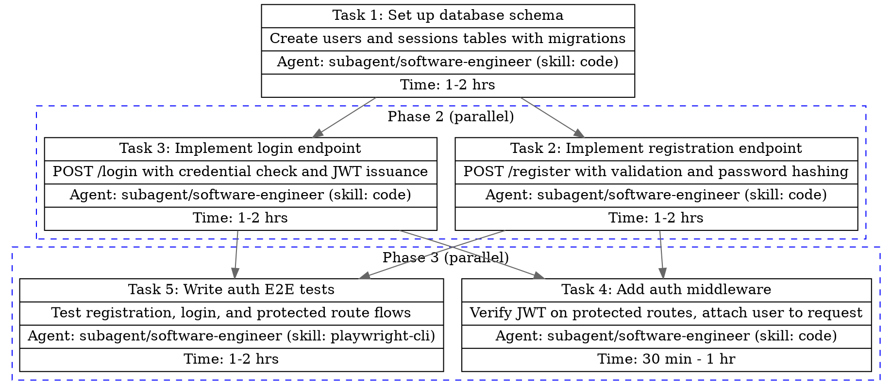

# DOT Digraph Specification

The main file MUST include a DOT language digraph that visualizes the execution plan. This reference covers the exact format.

## Graph Setup

Always start with:

```dot
digraph TaskPlan {
  rankdir=TB;
  node [shape=record, style=filled, fillcolor=white];
  edge [color=gray40];

  // nodes and edges here
}
```

- `rankdir=TB` — top-to-bottom layout (phases flow downward)
- `shape=record` — enables multi-row labels with `|` separators
- `fillcolor=white` — clean default background

## Node Format

Each task is a node with a record label containing 4 fields separated by `|`:

```dot
task_<N> [
  label="{Task <N>: <Title> | <Description truncated to ~80 chars> | Agent: <agent string> | Time: <estimate>}"
  URL="./<feature>__task-<NNN>.md"
];
```

Rules:

- The label MUST be a single continuous string inside `{}`
- No line breaks inside the `{}` — fields are separated by `|` only
- Description should be truncated to ~80 characters if longer
- The `URL` attribute links to the per-task file (relative path)
- Node ID is `task_<N>` where N matches the task number (no zero-padding)

## Edge Format

Edges represent dependencies — draw from the dependency TO the dependent task:

```dot
task_1 -> task_3;   // Task 3 depends on Task 1
task_2 -> task_4;   // Task 4 depends on Task 2
```

For tasks with multiple dependencies:

```dot
task_1 -> task_4;
task_2 -> task_4;
task_3 -> task_4;   // Task 4 depends on Tasks 1, 2, and 3
```

## Parallel Group Format

Tasks that can run concurrently (same phase, no dependencies between them) are wrapped in a `subgraph cluster_group_<N>` block:

```dot
subgraph cluster_group_<N> {
  label="Phase <N> (parallel)";
  style=dashed;
  color=blue;

  task_<A> [label="..." URL="..."];
  task_<B> [label="..." URL="..."];
}
```

Rules:

- Cluster name MUST start with `cluster_` (DOT requires this prefix for visual grouping)
- Label indicates the phase number and that tasks are parallel
- `style=dashed` and `color=blue` distinguish parallel groups visually
- A phase with only one task does NOT need a cluster — place it as a standalone node

## Sequential vs Parallel Placement

- **Phase with 1 task**: Place as standalone node (no cluster)
- **Phase with 2+ independent tasks**: Wrap in a cluster
- **All edges go outside clusters** — define edges after all nodes/clusters

## Complete Example

A 5-task plan with 3 phases:



This renders as:

```
        [Task 1: DB Schema]
           /          \
    [Task 2: Register] [Task 3: Login]
           \          /
        [Task 4: Middleware]  [Task 5: E2E Tests]
```

Phase 1 runs Task 1 alone. Phase 2 runs Tasks 2 and 3 in parallel. Phase 3 runs Tasks 4 and 5 in parallel (both depend on Tasks 2 and 3 completing).
